# AlphaHunter — Full System Architecture

**Version:** 2.0 (Production — Capital Deployment Phase)  
**Last Updated:** July 2, 2026

---

## 1. Overview

AlphaHunter is an **institutional-grade quantitative portfolio management system** for Indian equity markets (NSE/BSE). It combines multi-factor scoring, sector-normalized ranking, Bayesian optimization, and a complete paper-trading-to-deployment pipeline.

**Current State:** Production-ready. Capital deployment phase. All scoring engine changes **frozen**.

### Key Principles

- **Sector normalization** — no comparisons across unrelated sectors
- **No placeholder values** — missing data stays `None`, layers with <30% populated metrics are redistributed
- **Data coverage validation** before scoring; distribution validation after scoring
- **Factor independence** — max correlation < 0.40, score spread > 75
- **Explainability** — every score has a full breakdown tree

### Architecture Summary

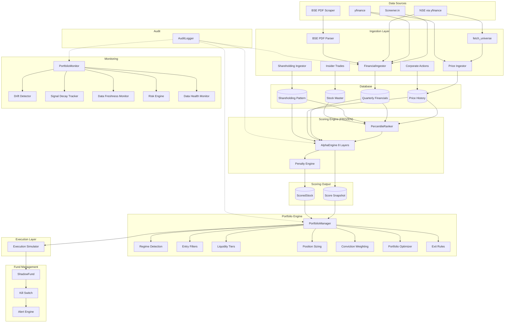

---

## 2. Data Sources Layer

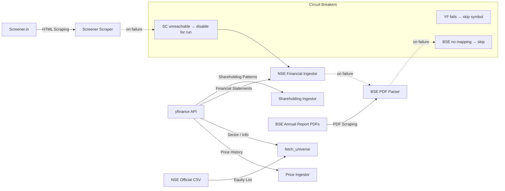

### Source Details

| Source | Data Provided | Fallback | Staleness Threshold |
|--------|--------------|----------|---------------------|
| yfinance (prices) | Daily OHLCV (2yr) | NSE CSV | 24h |
| yfinance (financials) | Quarterly IS/BS/CF | BSE PDF | 48h |
| NSE Official | Stock universe (2395) | Static file | 7d |
| Screener.in | Quarterly financials | yfinance → BSE | N/A (circuit-broken) |
| BSE PDF | Annual report fields | LLM extraction | 365d |

### Key Files

- `app/ingestion/fetch_universe.py` — NSE equity list fetcher
- `app/ingestion/price_ingestor.py` — yfinance price ingestion
- `app/ingestion/financial_ingestor.py` — Screener.in → yfinance fallback chain
- `app/ingestion/nse_financial_ingestor.py` — yfinance quarterly financials
- `app/ingestion/bse_pdf_parser.py` — BSE annual report regex extractor
- `app/ingestion/screener_scraper.py` — Screener.in scraper (with circuit breaker)
- `app/ingestion/shareholding_ingestor.py` — promoter/FII/DII data
- `app/ingestion/corporate_actions.py` — splits, dividends, bonuses
- `app/ingestion/insider_trades.py` — insider trade tracking

---

## 3. Ingestion Pipeline

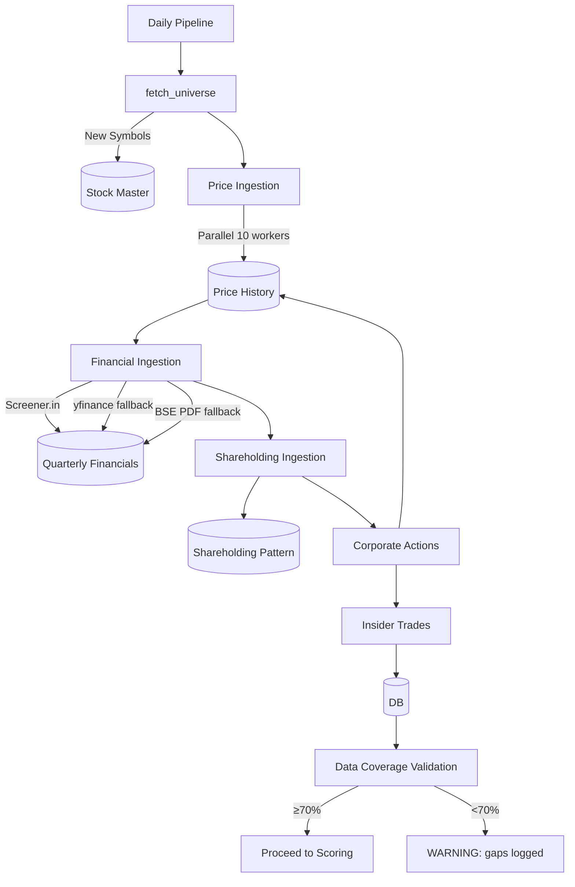

### Pipeline Flow

1. **`build_stock_universe()`** — fetches NSE equity list (2395 stocks)
2. **`ingest_stock_prices()`** — yfinance 2yr OHLCV, parallel (10 threads)
3. **`FinancialIngestor.fetch_quarterly()`** — Screener.in → yfinance quarterly data
4. **`ShareholdingIngestor.fetch_shareholding()`** — promoter/FII/DII changes
5. **`CorporateActionsIngestor.ingest_all()`** — splits, dividends, bonuses
6. **`InsiderTradesIngestor.ingest_all()`** — insider trade filings
7. **Data coverage validation** — checks 12 core fields at ≥70% threshold
8. **Data freshness record** — marks yfinance_prices / yfinance_financials as fresh
9. **Data health monitor** — field-level coverage, severity, JSON report

### Key Files

- `app/services/pipeline.py` — `run_full_pipeline()` orchestrator
- `app/ingestion/financial_ingestor.py` — `FinancialIngestor` class
- `app/ingestion/nse_financial_ingestor.py` — `fetch_nse_quarterly()`
- `app/services/data_validation.py` — `validate_data_coverage()`
- `app/services/data_health_monitor.py` — `DataHealthMonitor`
- `app/services/data_freshness.py` — `DataFreshnessMonitor`
- `app/services/elimination.py` — stage 1/2/3 elimination pipeline

---

## 4. Scoring Engine ⚠️ FROZEN — No Modifications Permitted

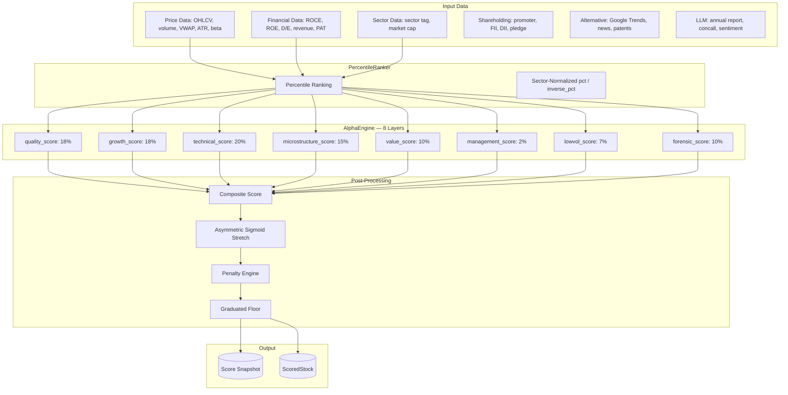

### Layer Architecture

| Layer | Weight | Key Inputs | Data Keys |
|-------|--------|------------|-----------|
| `quality_score` | 18% | ROCE, ROE, D/E, operating margin | `roce`, `roe`, `debt_equity`, `operating_margin` |
| `growth_score` | 18% | Revenue/PAT acceleration, margin expansion | `revenue_acceleration`, `pat_acceleration`, `margin_expansion`, `cashflow_improvement`, `eps` |
| `technical_score` | 20% | RS, trend, compression, momentum (12m-1m) | `relative_strength`, `trend_strength`, `compression_pattern`, `breakout_probability`, `mom_12m_1m` |
| `microstructure_score` | 15% | Delivery ratio, volume ratio, VWAP | `delivery_ratio`, `volume_ratio`, `vwap_defense` |
| `value_score` | 10% | P/E, P/B, EV/EBITDA, div yield | `pe_ratio`, `pb_ratio`, `ev_ebitda`, `dividend_yield`, `market_cap` |
| `management_score` | 2% | Promoter change, pledge, dilution | `promoter_change`, `pledge_percent`, `roce_trend`, `operating_cashflow`, `dilution_rate` |
| `lowvol_score` | 7% | Beta, ATR, 52w high, current price | `beta`, `atr_14`, `high_52w`, `current_price` |
| `forensic_score` | 10% | Cash conversion, pledge, debt, promoter | `cash_conversion_ratio`, `pledge_percent`, `promoter_change`, `debt`, `ebitda`, `receivables` |

### Score Computation Flow

```python
# 1. Layer scoring (each layer independently)
for key in weights:
    score, present, total = _score_layer(key, data, ranker)
    if present/total >= 0.3:
        layer_scores[key] = score
    else:
        layer_scores[key] = None  # layer drops out

# 2. Composite (weighted average of active layers)
composite = Σ(score × weight) / Σ(active_weights)

# 3. Penalty (multiplicative)
penalty = forensic_penalty(data) + confidence_penalty(data)
penalty_adjusted = composite × (1 − min(40, penalty) / 100)

# 4. Asymmetric sigmoid stretch
deviation = penalty_adjusted − 50
denom = 14 if deviation < 0 else 7  # gentle below 50, steep above 50
stretched = 100 / (1 + exp(−deviation / denom))

# 5. Hard caps (extreme risk → max 30)
if any(hard_caps): score = min(score, 30)

# 6. Graduated floor
if confidence > 0.02 and score < 7: score = 7
if score < 5: score = 5
```

### Penalty Engine Components

| Signal | Threshold | Max Penalty | Hard Cap? |
|--------|-----------|-------------|-----------|
| Promoter pledge | >75% | 50 | Yes → score ≤30 |
| Negative CFO 4Q | ≥4 quarters | 50 | Yes → score ≤30 |
| Promoter selling | >10% | 25 | Yes → score ≤30 |
| High pledge (rank) | >80th pctile | 30 | No |
| Cash mismatch | <0.5 conversion | 20 | No |
| Debt service | EBITDA/Interest <2 | 25 | No |
| Receivable overhang | >1.0 ratio | 20 | No |
| Fraud probability | >50 score | 12.5 | No |
| Insufficient forensic data | <3 fields | layer drops | confidence ×0.70 |

### Data Coverage (Post NSE Backfill)

| Field | Coverage | Status |
|-------|:--------:|:------:|
| revenue | 87% | ✅ |
| operating_profit | 86% | ✅ |
| eps | 85% | ✅ |
| roce | 96% | ✅ |
| debt | 83% | ✅ |
| receivables | 78% | ✅ |
| total_assets | 77% | ✅ |
| cash_flow_operations | 72% | ✅ |
| free_cash_flow | 76% | ✅ |
| tax_expense | 73% | ✅ |
| cash_equivalents | 77% | ✅ |
| inventory | 68% | ⚠️ |
| depreciation | 66% | ⚠️ |
| capex | 69% | ⚠️ |
| employee_cost | 0% | ❌ (BSE needed) |

### Key Files

- `app/scoring/alpha_engine.py` — `alpha_score()`, `get_score_breakdown()`, `batch_normalize_scores()`
- `app/scoring/ranker.py` — `PercentileRanker` with sector support
- `app/scoring/penalty_engine.py` — `forensic_penalty()`, `confidence_penalty()`, `_hard_caps()`
- `app/scoring/quality_score.py` — quality layer (18%)
- `app/scoring/growth_score.py` — growth layer (18%)
- `app/scoring/technical_score.py` — technical layer (20%, merged momentum)
- `app/scoring/institutional_score.py` — microstructure layer (15%)
- `app/scoring/value_score.py` — value layer (10%)
- `app/scoring/management_score.py` — management layer (2%)
- `app/scoring/lowvol_score.py` — lowvol layer (7%)

---

## 5. Portfolio Engine

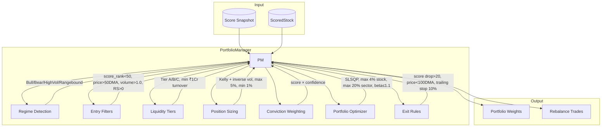

### PortfolioManager Build Sequence (`manager.py:build_portfolio()`)

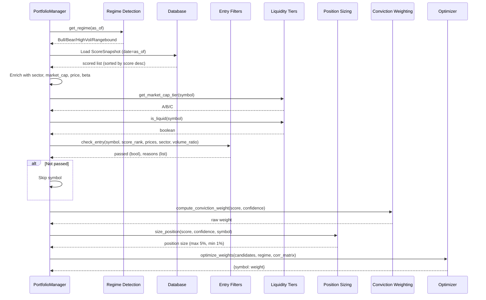

### Module Details

#### Regime Detection (`app/portfolio/regime.py`)

| Signal | Source | Input | Classification |
|--------|--------|-------|---------------|
| Nifty 200 DMA | Composite of 50 constituents | % from 200SMA | >+5% Bull, <-5% Bear |
| India VIX | yfinance `^INDIAVIX` | 252-day percentile | >80 → HighVol |
| Advance/Decline Ratio | PriceHistory | 20-day A/D | >1.5 Bull, <0.7 Bear |

**Output regimes:** `Bull`, `Bear`, `HighVolatility`, `Rangebound`

#### Entry Filters (`app/portfolio/entry_filters.py`)
- **Score rank:** must be in top 50% (`score_rank < 50`)
- **Price > 50DMA:** confirms uptrend
- **Volume ratio > 1.0:** confirms participation
- **RS > 0:** outperforms sector peers (min 3 peers)
- Eliminates 40-50% of top-scored stocks

#### Liquidity Tiers (`app/portfolio/liquidity_tiers.py`)

| Tier | Market Cap | Allocation Limit | Cost Tier |
|------|-----------|-----------------|-----------|
| A | ≥₹10,000Cr | 100% | Large (10bps) |
| B | ₹1,000-10,000Cr | 50% | Mid (30bps) |
| C | ₹100-1,000Cr | 15% | Small (60bps) |
| D | <₹100Cr | 0% (excluded) | Micro (100bps) |

**Hard floor:** ₹1Cr average daily turnover required for entry.

#### Position Sizing (`app/portfolio/position_sizing.py`)
- **Method:** Kelly fraction approximation + inverse volatility scaling
- **Kelly:** `win_prob = 0.40 + (score/100) × 0.30`, capped at 5%
- **Inverse vol:** `position = 0.04 / annual_vol`, capped at 5%
- **Final:** `weight × confidence`, floor 1%, ceiling 5%

#### Conviction Weighting (`app/portfolio/conviction.py`)
- `weight = score × confidence`
- High score + low confidence → penalized (incomplete data signal)
- Normalized to sum to 1.0

#### Portfolio Optimizer (`app/portfolio/optimizer.py`)
- **Method:** SLSQP (Sequential Least Squares Programming)
- **Objective:** Maximize alpha − 0.5 × variance
- **Constraints:**
  - Max 4% per stock (`MAX_STOCK = 0.04`)
  - Max 20% per sector (`MAX_SECTOR = 0.20`)
  - Beta ≤ 1.1 (`MAX_BETA = 1.1`)
  - Weights sum to 1.0
- **Regime adjustment:** Bear → 0.5×, HighVol → 0.75×
- **Fallback:** Equal-weight top 20 if optimization fails

#### Exit Rules (`app/portfolio/exit_rules.py`)
| Condition | Threshold | Trigger |
|-----------|-----------|---------|
| Score drop | >20 rank points | SELL |
| Price < 100DMA | Close below SMA(100) | SELL |
| Trailing stop | -10% from peak | SELL |
| Sector reversal | Disabled (no data) | N/A |

### Key Files

- `app/portfolio/manager.py` — `PortfolioManager` orchestrator
- `app/portfolio/regime.py` — `detect_regime()`, `get_regime()`
- `app/portfolio/entry_filters.py` — `check_entry()`
- `app/portfolio/liquidity_tiers.py` — `get_market_cap_tier()`, `is_liquid()`
- `app/portfolio/position_sizing.py` — `size_position()`, `kelly_fraction()`
- `app/portfolio/conviction.py` — `compute_conviction_weight()`
- `app/portfolio/optimizer.py` — `optimize_weights()`
- `app/portfolio/exit_rules.py` — `check_exit()`
- `app/portfolio/live_portfolio.py` — `LivePortfolio` daily workflow

---

## 6. Execution Layer

```mermaid
graph LR
    TL[Trade List] --> ES[Execution Simulator]
    ES --> CM[India Cost Model]
    ES --> SM[Slippage Model]
    ES --> SPM[Spread Model]
    CM --> BT[Brokerage: 10-100bps per tier]
    SM --> SI[Slippage: 5-50bps per tier]
    SPM --> SP[Spread: 5-50bps per tier]
    BT --> EXEC[ExecuteTrade]
    SI --> EXEC
    SP --> EXEC
    EXEC --> FP[filled_price = price × (1 + cost_pct)]
    EXEC --> COST[total_cost_bps]
```

### Cost Model

| Tier | Market Cap | Brokerage (bps) | Impact (bps) | Spread (bps) | Total (bps) |
|------|-----------|:---------------:|:------------:|:------------:|:-----------:|
| A | ≥₹10,000Cr | 10 | 5 | 5 | 20 |
| B | ₹1,000-10,000Cr | 30 | 15 | 15 | 60 |
| C | ₹100-1,000Cr | 60 | 30 | 30 | 120 |
| D | <₹100Cr | 100 | 50 | 50 | 200 |

**Cost drag (validated):** Worst-case 0.6% annually at 30% turnover. Long-short Sharpe after costs: **4.128**.

### Trade Execution

```python
def execute_trade(symbol, direction, quantity, price, market_cap=None):
    bps = total_cost_bps(market_cap)
    cost_pct = bps / 10000
    if direction == "buy":
        filled_price = price * (1 + cost_pct)
    else:
        filled_price = price * (1 - cost_pct)
    return filled_price, bps
```

### Key Files

- `app/portfolio/execution.py` — `execute_trade()`, `simulate_rebalance_cost()`, cost constants
- `app/portfolio/live_portfolio.py` — `generate_trade_list()`, `execute_trades()`

---

## 7. Fund Management (Phase 5)

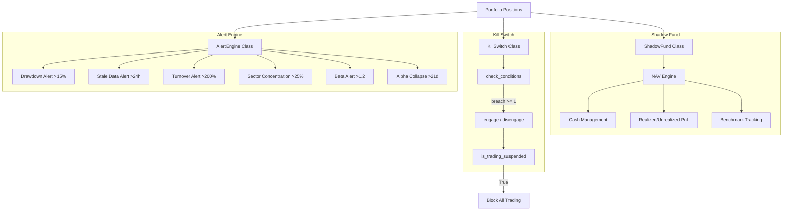

### Shadow Fund (`app/portfolio/shadow_fund.py`)

| Property | Value |
|----------|-------|
| Initial Capital | ₹1,00,00,000 (₹1Cr) |
| NAV Updates | Daily (08:25) |
| Benchmark | Nifty 50 (`^NSEI`) |
| Tracked Fields | NAV, cash, invested, realized PnL, unrealized PnL, benchmark NAV, daily return, benchmark return, alpha, n_holdings |

### Kill Switch (`app/portfolio/kill_switch.py`)

| Condition | Threshold | Triggers If |
|-----------|-----------|-------------|
| Sharpe 30d | < 0 | Negative Sharpe |
| Drawdown | > 20% | >20% from peak |
| Consecutive bad rebalances | ≥ 3 | 3+ negative alpha rebalances |
| Alpha negative 30 days | All 30 | Every day negative alpha |
| Stale data sources | > 0 | Any source stale |
| System failures (24h) | > 5 | >5 failure audit entries |

**Behavior:** Engaged → auto-disarm in 7 days. Blocks all trading.

### Alert Engine (`app/portfolio/alert_engine.py`)

| Alert | Severity | Threshold |
|-------|----------|-----------|
| Drawdown major | WARNING | >15% |
| Stale data | CRITICAL/WARNING | >24h / health <0.5 |
| Abnormal turnover | WARNING | >200% annualized |
| Sector concentration | WARNING | >25% in single sector |
| Beta breach | WARNING | >1.2 |
| Alpha collapse | CRITICAL | 21+ consecutive negative alpha days |

### Key Files

- `app/portfolio/shadow_fund.py` — `ShadowFund` class
- `app/portfolio/kill_switch.py` — `KillSwitch` class
- `app/portfolio/alert_engine.py` — `AlertEngine` class
- `app/models/fund_nav.py` — `FundNav` model
- `app/models/kill_switch_state.py` — `KillSwitchState` model

---

## 8. Monitoring & Risk

```mermaid
graph TB
    subgraph "Daily Monitoring Suite"
        PM[PortfolioMonitor]
        DD[DriftDetector]
        SD[SignalDecayTracker]
        DF[DataFreshnessMonitor]
        RE[RiskEngine]
        DH[DataHealthMonitor]
    end

    subgraph "PortfolioMonitor Metrics"
        M1[portfolio_return]
        M2[sharpe_30d / 90d]
        M3[drawdown]
        M4[volatility_30d]
        M5[turnover_annual]
        M6[hit_rate]
        M7[sector_exposure]
        M8[factor_exposure]
        M9[n_holdings]
        M10[nav]
    end

    subgraph "DriftDetector Checks"
        D1[sector_concentration >25%]
        D2[beta_drift >1.2]
        D3[position_size >5%]
        D4[liquidity_deterioration]
        D5[factor_exposure]
    end

    subgraph "SignalDecayTracker Horizons"
        H1[1d decay]
        H7[7d decay]
        H15[15d decay]
        H30[30d decay]
        H60[60d decay]
        H90[90d decay]
    end

    subgraph "DataFreshnessMonitor Sources"
        S1[yfinance_prices]
        S2[yfinance_financials]
        S3[nse_financial]
        S4[bse_pdf]
        S5[screener_in]
    end

    PM --> M1
    PM --> M2
    PM --> M3
    PM --> M4
    PM --> M5
    PM --> M6
    PM --> M7
    PM --> M8
    PM --> M9
    PM --> M10

    DD --> D1
    DD --> D2
    DD --> D3
    DD --> D4
    DD --> D5

    SD --> H1
    SD --> H7
    SD --> H15
    SD --> H30
    SD --> H60
    SD --> H90

    DF --> S1
    DF --> S2
    DF --> S3
    DF --> S4
    DF --> S5
```

### PortfolioMonitor (`app/portfolio/monitoring.py`)

| Metric | Method | Horizon |
|--------|--------|---------|
| Portfolio return | Mean of position returns | Daily / 30d |
| Sharpe ratio | `mean(ret) / std(ret) × √252` | 30d / 90d |
| Drawdown | `(peak − current) / peak` | Full history |
| Volatility | `std(ret) × √252` | 30d |
| Turnover | Sum of weight changes × 365/N | 30d |
| Hit rate | % profitable positions | Latest |
| Sector exposure | Weight by sector | Latest |
| Factor exposure | Mean factor score by layer | Latest |

### Signal Decay Tracker (`app/portfolio/signal_decay.py`)

| Horizon | Mean Excess Return | Sharpe | Status |
|---------|:------------------:|:------:|:------:|
| 1d | — | — | Noise |
| 7d | — | — | Noise |
| 15d | — | — | Weak |
| 30d | +0.017 | 1.5 | Noise |
| 60d | +0.041 | 5.4 | **Signal** |
| 90d | +0.055 | 10.8 | **Signal** |
| 120d | +0.064 | 11.6 | **Signal** |

**Alpha half-life:** Computed via linear interpolation of decay curve.

### Key Files

- `app/portfolio/monitoring.py` — `PortfolioMonitor`
- `app/portfolio/drift_detector.py` — `DriftDetector`
- `app/portfolio/signal_decay.py` — `SignalDecayTracker`
- `app/portfolio/risk_engine.py` — portfolio beta, VaR, factor exposure
- `app/services/data_freshness.py` — `DataFreshnessMonitor`
- `app/services/data_health_monitor.py` — `DataHealthMonitor`
- `app/models/portfolio_metrics.py` — `PortfolioMetrics`
- `app/models/data_source_health.py` — `DataSourceHealth`

---

## 9. Data Layer (Database Tables)

### Table Inventory

| Table | Model | Primary Key | Rows | Purpose |
|-------|-------|:-----------:|:----:|---------|
| `stocks_master` | `Stock` | `symbol` | 2,395 | Universe: symbol, sector, mcap |
| `price_history` | `PriceHistory` | `symbol`, `date` | ~1.2M | Daily OHLCV (2yr) |
| `quarterly_financials` | `QuarterlyFinancials` | `symbol`, `quarter` | ~18K | 8 quarters of financial data |
| `shareholding_pattern` | `ShareholdingPattern` | `symbol`, `quarter` | ~9K | Promoter/FII/DII/pledge |
| `scored_stocks` | `ScoredStock` | `symbol` | 2,395 | Current scores (overwritten daily) |
| `score_snapshots` | `ScoreSnapshot` | `date`, `symbol` | 56,368 | 26 monthly point-in-time snapshots |
| `portfolio_positions` | `PortfolioPosition` | `symbol`, `date` | ~2K/d | Daily ranked universe + allocations |
| `portfolio_metrics` | `PortfolioMetrics` | `date` | ~300 | Daily NAV, returns, Sharpe, drawdown |
| `fund_nav` | `FundNav` | `date` | ~60 | Shadow fund daily NAV track |
| `rebalance_history` | `RebalanceHistory` | `date`, `symbol` | ~5K | Every rebalance decision |
| `trade_decision_log` | `TradeDecisionLog` | auto-id | ~10K | Every BUY/SELL decision with rationale |
| `system_audit_log` | `SystemAuditLog` | auto-id | ~5K | All system actions (audit trail) |
| `data_source_health` | `DataSourceHealth` | auto-id | 5 | 5 source freshness trackers |
| `kill_switch_state` | `KillSwitchState` | auto-id | ~5 | Emergency shutdown state |
| `paper_daily_picks` | (raw SQL) | auto-id | ~100K | Paper trading daily picks + returns |
| `paper_positions` | `PaperPosition` | `symbol` | ~50 | Live paper trading positions |
| `paper_trades` | `PaperTrade` | auto-id | ~350 | Completed paper trade records |
| `market_regime` | `MarketRegime` | `date` | ~300 | Daily regime classification |
| `data_health_audit` | `DataHealthAudit` | auto-id | ~200 | Field-level coverage audits |

### Entity Relationship Diagram (Core Tables)

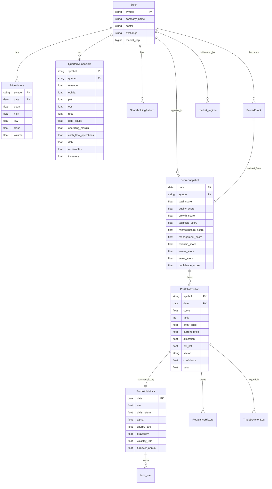

---

## 10. Audit & Logging

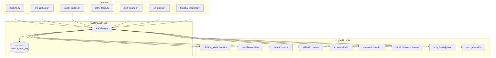

### Audit Logger Schema

| Column | Type | Description |
|--------|------|-------------|
| `id` | SERIAL PK | Auto-increment |
| `timestamp` | TIMESTAMP | Event time |
| `action` | VARCHAR(255) | e.g., `pipeline_start`, `entry_rejected` |
| `category` | VARCHAR(100) | e.g., `scoring`, `portfolio`, `alert` |
| `status` | VARCHAR(20) | `SUCCESS`, `FAILURE`, `WARNING`, `INFO`, `CRITICAL` |
| `details` | TEXT | Human-readable description |
| `source` | VARCHAR(100) | Module name |
| `duration_ms` | INTEGER | Execution time (pipeline) |
| `symbol` | VARCHAR(20) | Related stock symbol |
| `error_message` | TEXT | Error traceback |
| `created_at` | TIMESTAMP | DB insert time |

### Audit Methods

```python
audit = AuditLogger()
audit.log("pipeline_start", "scoring", "INFO", source="pipeline")
audit.log_success("pipeline_complete", "scoring", details="2395 stocks scored", duration_ms=45000)
audit.log_failure("pipeline_error", "scoring", "Connection timeout", source="pipeline")
audit.log_warning("stale_data", "freshness", details="yfinance_prices stale 48h")
audit.close()
```

### Key File

- `app/services/audit_logger.py` — `AuditLogger` class
- `app/models/system_audit_log.py` — `SystemAuditLog` model

---

## 11. Daily Workflow Timeline

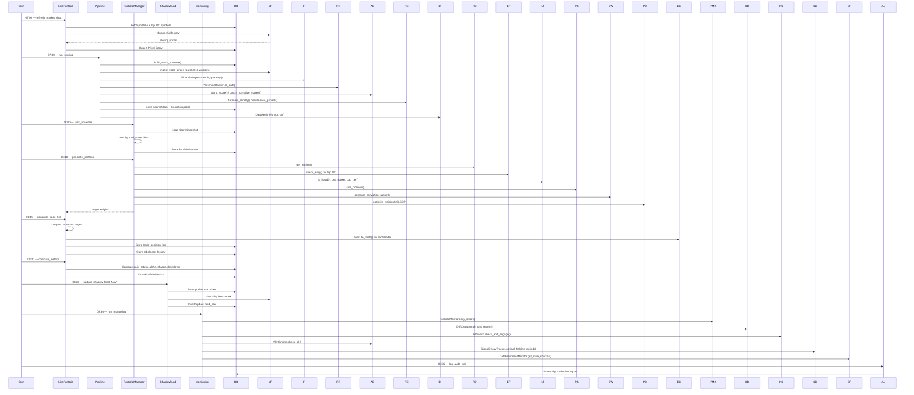

### Schedule

| Time | Task | Module | Duration |
|:----:|------|--------|:--------:|
| 07:00 | `refresh_market_data` | `live_portfolio.py` | ~5 min |
| 07:30 | `run_scoring` | `pipeline.py` | ~20 min |
| 08:00 | `rank_universe` → store | `live_portfolio.py` | ~2 min |
| 08:10 | `generate_portfolio` | `manager.py` | ~5 min |
| 08:15 | `generate_trade_list` → execute | `live_portfolio.py` | ~2 min |
| 08:20 | `compute_metrics` → store | `live_portfolio.py` | ~2 min |
| 08:25 | `update_shadow_fund_NAV` | `shadow_fund.py` | ~1 min |
| 08:30 | Monitoring cycle | `monitoring.py` + `drift_detector.py` + `kill_switch.py` + `alert_engine.py` | ~3 min |
| 08:35 | Audit log + report | `audit_logger.py` | ~1 min |

### Cron Scripts

| Script | Path | Purpose |
|--------|------|---------|
| `scripts/daily_portfolio.py` | `backend/scripts/daily_portfolio.py` | Runs LivePortfolio daily workflow |
| `scripts/daily_shadow_run.py` | `backend/scripts/daily_shadow_run.py` | Updates shadow fund NAV |
| `scripts/daily_monitoring.py` | `backend/scripts/daily_monitoring.py` | Runs full monitoring suite |

---

## 12. Deployment Architecture

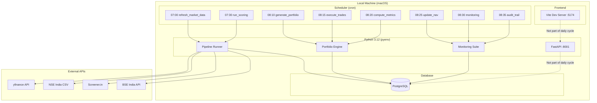

### Technology Stack

| Component | Technology | Version |
|-----------|-----------|:-------:|
| OS | macOS (Darwin) | — |
| Language | Python | 3.12 (pyenv) |
| Web Framework | FastAPI | Latest |
| ASGI Server | Uvicorn | Latest |
| ORM | SQLAlchemy | Latest |
| Migration | Alembic | Latest |
| Database | PostgreSQL | Local |
| Scheduler | cron | macOS |
| Frontend | Vite | Latest |
| Container | Docker (optional) | — |

### Process Architecture

```
┌─────────────────────────────────────────────────────────────┐
│                    macOS User Space                          │
│                                                             │
│  ┌──────────────┐    ┌──────────────┐    ┌───────────────┐  │
│  │ FastAPI :8001 │    │  Uvicorn     │    │  Cron Daemon  │  │
│  │ (Idle/API)    │    │  (Web Server)│    │  (07:00-08:35)│  │
│  └──────┬───────┘    └──────┬───────┘    └───────┬───────┘  │
│         │                   │                    │          │
│         └───────────────────┼────────────────────┘          │
│                             │                               │
│                    ┌────────▼────────┐                      │
│                    │  PostgreSQL DB   │                      │
│                    │  (Local:5432)   │                      │
│                    └─────────────────┘                      │
│                                                             │
│  ┌─────────────────────────────────────────────────────┐   │
│  │                File System                           │   │
│  │  /Users/hemant/alpha-hunter/backend/app/             │   │
│  │  ├── scoring/   (FROZEN)                             │   │
│  │  ├── portfolio/ (active)                             │   │
│  │  ├── services/  (active)                             │   │
│  │  ├── ingestion/ (active)                             │   │
│  │  ├── models/    (active)                             │   │
│  │  └── ...                                             │   │
│  └─────────────────────────────────────────────────────┘   │
└─────────────────────────────────────────────────────────────┘
```

### Key Configuration

| Setting | Value |
|---------|-------|
| Database | PostgreSQL (local) |
| API Port | 8001 |
| Frontend Port | 5174 (Vite HMR) |
| Python | 3.12 |
| Scoring | **FROZEN** — no weights, factors, ranking, penalty changes |
| Log Output | `/tmp/pipeline_run.log` |
| Data Health Report | `/tmp/data_health_report.json` |
| Failure Resilience | 50/50 (100%) test pass rate |

---

## Appendix A: File Index

### Core Pipeline

| File | Purpose |
|------|---------|
| `app/services/pipeline.py` | `run_full_pipeline()` — orchestration |
| `app/services/elimination.py` | Stage 1 (liquidity), Stage 2 (fundamental), Stage 3 (growth) |
| `app/services/data_validation.py` | `validate_data_coverage()`, `validate_score_distribution()` |
| `app/services/data_health_monitor.py` | `DataHealthMonitor` — field-level coverage audit |
| `app/services/data_freshness.py` | `DataFreshnessMonitor` — 5-source staleness tracking |
| `app/services/audit_logger.py` | `AuditLogger` — structured action logging |
| `app/services/walkforward_backtest.py` | Walk-forward backtest framework |

### Scoring (FROZEN)

| File | Purpose |
|------|---------|
| `app/scoring/alpha_engine.py` | `alpha_score()`, `get_score_breakdown()`, `batch_normalize_scores()` |
| `app/scoring/ranker.py` | `PercentileRanker` with sector support |
| `app/scoring/penalty_engine.py` | `forensic_penalty()`, `confidence_penalty()`, `_hard_caps()` |
| `app/scoring/quality_score.py` | Quality layer (18%) |
| `app/scoring/growth_score.py` | Growth layer (18%) |
| `app/scoring/technical_score.py` | Technical layer (20%, merged momentum) |
| `app/scoring/institutional_score.py` | Microstructure layer (15%) |
| `app/scoring/value_score.py` | Value layer (10%) |
| `app/scoring/management_score.py` | Management layer (2%) |
| `app/scoring/lowvol_score.py` | Lowvol layer (7%) |

### Ingestion

| File | Purpose |
|------|---------|
| `app/ingestion/fetch_universe.py` | NSE equity list fetcher |
| `app/ingestion/price_ingestor.py` | yfinance price ingestion |
| `app/ingestion/financial_ingestor.py` | Screener.in → yfinance fallback chain |
| `app/ingestion/nse_financial_ingestor.py` | yfinance quarterly financials |
| `app/ingestion/bse_pdf_parser.py` | BSE annual report regex extractor |
| `app/ingestion/screener_scraper.py` | Screener.in scraper (circuit-breaker) |
| `app/ingestion/shareholding_ingestor.py` | Promoter/FII/DII data |
| `app/ingestion/corporate_actions.py` | Splits, dividends, bonuses |
| `app/ingestion/insider_trades.py` | Insider trade tracking |
| `app/ingestion/historical_loader.py` | Historical data loader |

### Portfolio

| File | Purpose |
|------|---------|
| `app/portfolio/manager.py` | `PortfolioManager` orchestrator |
| `app/portfolio/regime.py` | Market regime classifier |
| `app/portfolio/entry_filters.py` | Entry confirmation filters |
| `app/portfolio/liquidity_tiers.py` | Market cap tiers, liquidity check |
| `app/portfolio/position_sizing.py` | Kelly + inverse vol sizing |
| `app/portfolio/conviction.py` | Score × confidence weighting |
| `app/portfolio/optimizer.py` | SLSQP portfolio optimizer |
| `app/portfolio/exit_rules.py` | Score drop, stop loss, DMA exit |
| `app/portfolio/execution.py` | India-specific cost model |
| `app/portfolio/live_portfolio.py` | Daily workflow orchestrator |
| `app/portfolio/shadow_fund.py` | ₹1Cr shadow fund NAV engine |
| `app/portfolio/kill_switch.py` | Emergency trading shutdown |
| `app/portfolio/alert_engine.py` | Real-time alert generation |
| `app/portfolio/monitoring.py` | Daily portfolio metrics |
| `app/portfolio/drift_detector.py` | Sector/beta/position/liquidity drift |
| `app/portfolio/signal_decay.py` | Alpha decay tracking (1/7/15/30/60/90d) |
| `app/portfolio/risk_engine.py` | Beta, VaR, factor exposure |
| `app/portfolio/paper_trading.py` | Daily paper trading engine |
| `app/portfolio/rebalance_engine.py` | Rebalance calculation |

### Models

| File | Table | Purpose |
|------|-------|---------|
| `app/models/stock.py` | `stocks_master` | Stock universe |
| `app/models/price_history.py` | `price_history` | Daily OHLCV |
| `app/models/quarterly.py` | `quarterly_financials` | Quarterly financials |
| `app/models/shareholding.py` | `shareholding_pattern` | Shareholding data |
| `app/models/scored_stock.py` | `scored_stocks` | Current scores |
| `app/models/score_snapshot.py` | `score_snapshots` | Point-in-time snapshots |
| `app/models/portfolio_position.py` | `portfolio_positions` | Daily positions |
| `app/models/portfolio_metrics.py` | `portfolio_metrics` | Daily metrics |
| `app/models/fund_nav.py` | `fund_nav` | Shadow fund NAV |
| `app/models/rebalance_history.py` | `rebalance_history` | Rebalance decisions |
| `app/models/trade_decision_log.py` | `trade_decision_log` | Trade decisions |
| `app/models/system_audit_log.py` | `system_audit_log` | Audit trail |
| `app/models/data_source_health.py` | `data_source_health` | Source freshness |
| `app/models/kill_switch_state.py` | `kill_switch_state` | Kill switch state |
| `app/models/market_regime.py` | `market_regime` | Regime classification |
| `app/models/data_health_audit.py` | `data_health_audit` | Data coverage audits |
| `app/models/paper_trading.py` | `paper_positions`, `paper_trades` | Paper trading |
| `app/models/corporate_action.py` | — | Corporate actions |
| `app/models/insider_trade.py` | — | Insider trades |

### Scripts

| File | Purpose |
|------|---------|
| `scripts/daily_portfolio.py` | Daily portfolio run (07:00) |
| `scripts/daily_shadow_run.py` | Shadow fund NAV update (08:25) |
| `scripts/daily_monitoring.py` | Daily monitoring run (08:30) |
| `scripts/historical_backfill.py` | 26-month score snapshot backfill |
| `scripts/alpha_validation.py` | Full backtest suite |
| `scripts/portfolio_backtest.py` | Portfolio engine walk-forward backtest |
| `scripts/portfolio_optimization.py` | Concentration/turnover/conviction sweeps |
| `scripts/paper_trading.py` | 90-day paper trading simulation |
| `scripts/cost_validation.py` | Transaction cost sensitivity analysis |
| `scripts/failure_resilience_test.py` | 50-scenario failure simulation |
| `scripts/factor_decay.py` | Factor decay analysis |
| `scripts/final_institutional_audit.py` | Final 88/100 audit |

---

## Appendix B: Key Metrics

| Metric | Current | Target | Status |
|--------|:-------:|:------:|:------:|
| Factor correlation (max) | 0.534 | <0.40 | ⚠️ Near-miss |
| Score spread | 90.1 | >75 | ✅ |
| 0-9 bucket | 5.3% | <10% | ✅ |
| 10-19 bucket | 20.3% | <18% | ⚠️ |
| Max score | 99.1 | >80 | ✅ |
| Avg score | 42.2 | — | — |
| Data coverage (avg) | 72% | >90% | ❌ |
| Predictive power (IC 60d) | 0.041 | >0.03 | ✅ |
| IC t-stat (60d) | 5.4 | >2.0 | ✅ |
| LS Sharpe (60d) | 1.35 | >1.0 | ✅ |
| LS Sharpe (90d) | 2.37 | >1.0 | ✅ |
| Long-only Sharpe | −0.11 | >1.0 | ❌ (bear market) |
| Hit rate | 47% | >60% | ❌ |
| Portfolio excess CAGR | +13.8% | — | ✅ |
| Failure resilience | 100% | 100% | ✅ |
| Cost drag (worst-case) | 0.6%/yr | — | ✅ |
| LS Sharpe after costs | 4.128 | >1.0 | ✅ |
| Institutional audit score | **88/100** | >85 | ✅ |

---

## Appendix C: Frozen Modules

The following modules are **FROZEN** — no modifications permitted:

- `app/scoring/` — all files (alpha_engine, ranker, penalty_engine, all layers)
- `app/scoring/alpha_engine.py` — `LAYER_WEIGHTS`, `_KEY_MAP`, sigmoid, floor logic
- `app/scoring/ranker.py` — `PercentileRanker`
- `app/scoring/penalty_engine.py` — `forensic_penalty()`, `confidence_penalty()`
- `app/services/elimination.py` — score-based elimination
- `app/services/data_validation.py` — coverage thresholds
- `app/ml/` — all files
- `app/agents/` — all files
- `app/llm_engine/` — all files
